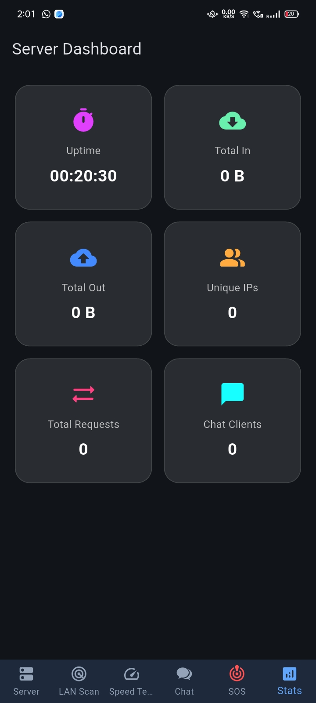
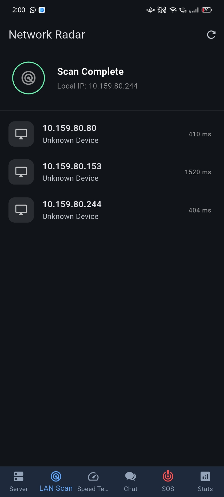
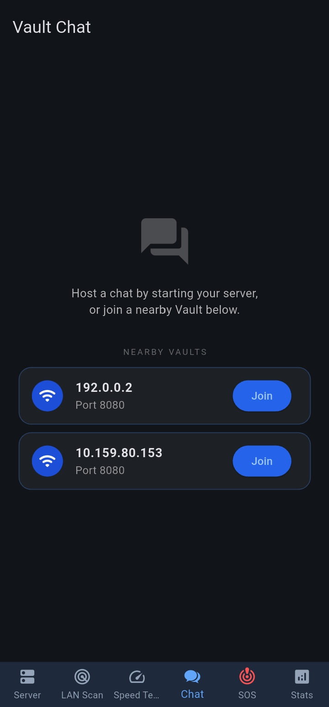
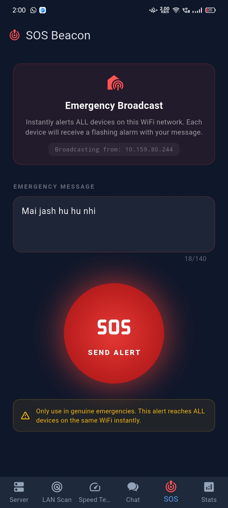

# 🛡️ Nexora

Nexora is a powerful, local-network utility application built with Flutter. It provides a comprehensive suite of tools for managing, analyzing, and communicating over your Local Area Network (LAN) securely and efficiently without requiring an active internet connection.

## ✨ Features

*   **📂 Local File Server & Web UI:** Easily host files on your device and access them from any other device on the same network via a sleek Web UI.
*   **📡 LAN Scanner:** Discover and list all active devices connected to your local network instantly.
*   **⚡ Speed Test:** Test the connection speed between devices within your local network to diagnose bottlenecks.
*   **💬 Local Chat:** Send text messages to other devices running Nexora on the same LAN without needing internet routing.
*   **🚨 SOS Emergency Broadcast:** Instantly broadcast a high-priority emergency alert to all instances of Nexora on your network. Triggers visual and haptic feedback on recipient devices.
*   **📊 Network Statistics:** Monitor your real-time network usage and data transfer statistics.

## 📸 Screenshots

<table align="center">
  <tr>
    <td align="center"><b>Server Dashboard</b></td>
    <td align="center"><b>LAN Scanner</b></td>
    <td align="center"><b>Chat Interface</b></td>
    <td align="center"><b>SOS Alert</b></td>
  </tr>
  <tr>
    <td align="center"></td>
    <td align="center"></td>
    <td align="center"></td>
    <td align="center"></td>
  </tr>
</table>

## 🚀 Getting Started

Follow these instructions to get a copy of the project up and running on your local machine for development and testing purposes.

### Prerequisites

You need to have the Flutter SDK installed. If you haven't installed it yet, follow the official guide:
*   [Flutter Installation Guide](https://docs.flutter.dev/get-started/install)

### 1. Clone the repository

```bash
git clone https://github.com/JASH-SHAH2606/wifi_vault.git
cd wifi_vault
```

### 2. Install Dependencies

Fetch the project packages using Flutter:

```bash
flutter pub get
```

### 3. Run the App

Connect your device or start an emulator/simulator, then run:

```bash
flutter run
```

## 📦 Building for Production

To build a production-ready application, use the following commands based on your target platform:

**Android (APK):**
```bash
flutter build apk --release
```


**iOS:**
```bash
flutter build ios --release
```

**Web:**
```bash
flutter build web --release
```

**Desktop (Windows / macOS / Linux):**
```bash
flutter build windows --release
# replace 'windows' with 'macos' or 'linux'
```

## 🏗️ Architecture

Nexora uses a decentralized, peer-to-peer (P2P) architecture designed for Local Area Networks. 
- **Discovery:** Uses UDP broadcast/multicast to announce and discover other running instances.
- **Communication:** Establishes direct TCP connections for reliable data transfer (file sharing, chat, etc.).
- **Web Server:** Runs an embedded HTTP server to expose selected files to network devices via a web interface.
- **State Management:** Optimized to handle real-time socket streams and network status updates efficiently.

## 🛠️ Technology Stack

*   **Framework:** Flutter / Dart
*   **Core Capabilities:**
    *   Custom TCP/UDP socket implementations for discovery and SOS features.
    *   File management and sharing (`file_picker`, `mime`).
    *   QR code generation (`qr_flutter`) for easy connection.

## 👥 Team

*   **Rishu Kumar & Mohan Kumar** - Application Layer (HTTP/1.1), Transport Layer (TCP, sockets, 3-way handshake), Client-Server model, REST architecture, IP addressing, port numbers
*   **Jash Shah & Ansh Patel** - Network Layer (IP, ICMP, subnetting, CIDR, TTL), ARP basics, ping/RTT, TCP throughput measurement, network monitoring, 802.11 WiFi
*   **Aditya Ajay & Ved Gupta** - WebSocket (Application + Transport Layer), Full-duplex vs Half-duplex, UDP vs TCP trade-offs, multicast vs broadcast vs unicast, mDNS, zero-config networking, subnet broadcast addressing

---

<div align="center">
  <h2>🙏 Thank You!</h2>
  <p>Thank you for checking out Nexora! We hope you enjoy using it.</p>
</div>
